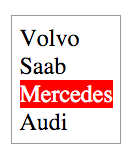

# What is React?

React is a JavaScript tool that makes it easy to reason about, construct, and maintain stateless and stateful user interfaces. It provides the means to declaratively define and divide a UI into UI components (aka React components) made up of HTML like nodes (aka React nodes).

I could ramble on trying to express in words what React is, but I think it  best to initial just show you. What follows is a whirl wind tour of React and React components from thirty thousand feet. Don't try and figure out all the details yet as I describe React in this section. Just follow along grabbing a hold of the gist of it for now.

## Using React to create UI components similar to a `<select>`

An HTML `<select>` is not unlike a React component and is a good place to start learning about the nature of a React component.

Below is an HTML `<select>` element that encapsulates child HTML `<option>` elements. Hopefully the creation and functionality of a `<select>` is already familiar.

[source code](https://jsfiddle.net/s2pxp36L/#tabs=html,result)

When a browser parses the above tree of elements it will produce a UI containing a textual list of items that can be selected. Click on the "Result" tab in the above JSFiddle, to see what the browser produces. 

The browser, [the DOM](http://domenlightenment.com/), and the [shadow DOM](https://developer.mozilla.org/en-US/docs/Web/Web_Components/Shadow_DOM) are working together behind the scenes to turn the `<select>` HTML into a UI component. Note that the `<select>` component allows the user to make a selection thus storing the state of that selection (i.e. click on "Volvo", and you have selected it instead of "Mercedes").

Using React we can essentially do the same exact thing but instead of using HTML elements directly we use React nodes and the virtual DOM that in turn will create real HTML elements in an HTML page (i.e. the DOM). 

Let's now create our own drop-down UI component using React.

## Defining a React component

Below I am creating a `<MySelect>` React component by invoking the `React.createClass` function in order to create a `MySelect` component class. 

As you can see the `MySelect` component is made up of an empty styled React `<div>` node element.

```js
var MySelect = React.createClass({ //define MySelect component
    render: function(){
        var mySelectStyle = {
            border: '1px solid #999',
            display: 'inline-block',
            padding: '5px'
        };
        // using {} to reference a JS variable inside of JSX
        return <div style={mySelectStyle}></div>; //react div element, via JSX
    }
});
```

That `<div>` is an HTML like tag, yes in JavaScript, called [JSX](https://facebook.github.io/jsx/). JSX is a custom JavaScript syntax used by React to express React nodes that map to real HTML elements and text nodes. React nodes, defined using JSX should not be considered a one to one match to HTML elements. There are [differences](https://facebook.github.io/react/docs/dom-differences.html) and some [gotchas](https://facebook.github.io/react/docs/jsx-gotchas.html). 

JSX syntax must be transformed from JSX to real JavaScript in order to be parsed by ES5 browsers. The above code, if not transformed would of course cause a JavaScript error. 

The official tool used to transform JSX to actual JavaScript code is called [Babel](http://babeljs.io/).

After Babel transforms the JSX `<div>` in the above code into real JavaScript, it will look like this:

```javascript
return React.createElement('div', { style: mySelectStyle });
```

instead of this:

```javascript
return <div style={mySelectStyle}></div>;
```

For now, just keep in mind that when you see HTML in React code it is/must be  transformed into actual JavaScript code by Babel, along with any ES6 syntax.

The `<MySelect>` component at this point consist of an empty React `<div>` node element. That seems rather pointless, so let's change that. 

I'm going to define another component called `<MyOption>` and then use the `<MyOption>` component within the `<MySelect>` component (aka composition).

Examine the updated JavaScript code below which defines both the `<MySelect>` and `<MyOption>` component.

```javascript
var MySelect = React.createClass({
    render: function(){
        var mySelectStyle = {
            border: '1px solid #999',
            display: 'inline-block',
            padding: '5px'
        };
        return ( //react div element, via JSX, containing <MyOption> component
            <div style={mySelectStyle}>
                <MyOption value="Volvo"></MyOption>
                <MyOption value="Saab"></MyOption>
                <MyOption value="Mercedes"></MyOption>
                <MyOption value="Audi"></MyOption>
            </div>
        );
    }
});

var MyOption = React.createClass({  //define MyOption component
    render: function(){
        return <div>{this.props.value}</div>; //react div element, via JSX
    }
});
```

You should note how the `<MyOption>` component is used inside of the `<MySelect>`` component.

## Passing Component Options Using React props

Notice in the update code is that the `<MyOption>` component is made up of one `<div>` containing the expression `{this.props.value}`. The `{}` brackets indicate to JSX that a JavaScript expression is being used. In other words, inside of `{}` you can write JavaScript. 

The `{}` brackets are used in the JSX to gain access (i.e. `this.props.value`) to the properties or attributes passed by the `<MyOption>` component. In other words when the `<MyOption>` component is rendering the `value` option, passed using an HTML-like attribute (i.e. `value="Volvo"`), will be placed into the `<div>`. These HTML looking attributes are consider React props. React uses them to pass stateless/immutable options into components.

## Rendering a component to the Virtual DOM, then HTML DOM

At this point our JavaScript only defines two React Components. We have yet to actually render these components to the Virtual DOM and thus to the HTML DOM.

Before we do that I'd like to mention that up to this point all we have done is define a UI component made up of two React components. In theory, the JavaScript we have so far is just the definition of a UI component. This same definition, in theory, could also be used to render this component to a [native mobile platform](https://github.com/facebook/react-native) or an [HTML canvas](https://github.com/Flipboard/react-canvas). But we're not going to do that, even though one could do that. Just be aware that React is a pattern for organizing a UI that can transcend the DOM, front-end applications, and [even the web platform](https://facebook.github.io/react/docs/top-level-api.html#reactdomserver).

Let's now render the `<MyOption>` component to the virtual DOM which in turn will render it to the actual DOM inside of an HTML page.

In the JavaScript below notice I added a call to the `ReactDOM.render()` function on the last line. Here I am passing the `ReactDOM.render()`  function the component we want to render (i.e. `<MyOption>`) and a reference to the HTML element already in the DOM (i.e. `<div id="app"></div>`) where I want to render my React `<MyOption>` component. Click on the "Result" tab and you will see our custom React `<MyOption>` component rendered to the HTML DOM.

[source code](https://jsfiddle.net/zp86ez31/#tabs=js,result,html,resources)

Hold up, you might be thinking. We haven't actually re-created a `<select>` at all. All we have done is create a static/stateless list of text. We'll fix that next.

Before I move on I want to point out that no implicit DOM interactions we're written to get the `<MyOption>` component into the real DOM. In other words, no jQuery code was invoke during the creation of this component. The dealings with the actual DOM have all been abstracted by the React virtual DOM.

## Using React state

In order for our `<MySelect>` component to mimic a native `<select>` element we are going to have to add state. State typically gets involved when a component contains snapshots of information. In regards to our custom `<MyOption>` component, it's state is the currently selected text or the fact that no text is selected at all. Note that state will typically involved user events (i.e. mouse, keyboard, clipboard etc.. ) or network events (i.e. AJAX) and is the value used to determine when the UI needs to be re-rendered (i.e. when value changes re-render).

State is typically found on the top most component which makes up a UI component. Using the React `getInitialState()` function we can set the default state of our component to `false` by returning a state object when `getInitialState` is invoked (i.e. `return {selected: false};`). 

I've update the code below accordingly to add state to the component. As I am making updates to the code, make sure you read the JavaScript comments which call attention to the changes in the code.

```javascript
var MySelect = React.createClass({
    getInitialState: function(){ //add selected, default state
        return {selected: false};
    },
    render: function(){
        var mySelectStyle = {
            border: '1px solid #999',
            display: 'inline-block',
            padding: '5px'
        };
        return (
            <div style={mySelectStyle}>
                <MyOption value="Volvo"></MyOption>
                <MyOption value="Saab"></MyOption>
                <MyOption value="Mercedes"></MyOption>
                <MyOption value="Audi"></MyOption>
            </div>
        );
    }
});

var MyOption = React.createClass({
    render: function(){
        return <div>{this.props.value}</div>;
    }
});
```

With the default state set, next we'll add a callback function called `select` that gets called when a user clicks on an option. Inside of this function we get the text of the option (via `event` parameter) that was selected and use that to determine how to `setState` on the current component. Notice that I am using `event` details passed to the `select` callback. This pattern should look familiar if you've had any experience with jQuery.

```javascript
var MySelect = React.createClass({
    getInitialState: function(){
        return {selected: false};
    },
    select:function(event){// added select function
        if(event.target.textContent === this.state.selected){//remove selection
            this.setState({selected: false}); //update state
        }else{//add selection
            this.setState({selected: event.target.textContent}); //update state
        }   
    },
    render: function(){
        var mySelectStyle = {
            border: '1px solid #999',
            display: 'inline-block',
            padding: '5px'
        };
        return (
            <div style={mySelectStyle}>
                <MyOption value="Volvo"></MyOption>
                <MyOption value="Saab"></MyOption>
                <MyOption value="Mercedes"></MyOption>
                <MyOption value="Audi"></MyOption>
            </div>
        );
    }
});

var MyOption = React.createClass({
    render: function(){
        return <div>{this.props.value}</div>;
    }
});
```

In order for our `<MyOption>` components to gain access to the `select` function we'll have to pass a reference to it, via props, from the `<MySelect>` component to the `<MyOption>` component. To do this we add `select={this.select}` to the `<MyOption>` components. 

With that in place we can add `onClick={this.props.select}` to the `<MyOption>` components. Hopefully its obvious that what all we have done is wired up a `click` event that will call the `select` function.

```javascript
var MySelect = React.createClass({
    getInitialState: function(){
        return {selected: false};
    },
    select:function(event){
        if(event.target.textContent === this.state.selected){
            this.setState({selected: false});
        }else{
            this.setState({selected: event.target.textContent});
        }   
    },
    render: function(){
        var mySelectStyle = {
            border: '1px solid #999',
            display: 'inline-block',
            padding: '5px'
        };
        return (//pass reference, using props, to select callback to <MyOption>
            <div style={mySelectStyle}>
                <MyOption select={this.select} value="Volvo"></MyOption>
                <MyOption select={this.select} value="Saab"></MyOption>
                <MyOption select={this.select} value="Mercedes"></MyOption>
                <MyOption select={this.select} value="Audi"></MyOption>
            </div>
        );
    }
});

var MyOption = React.createClass({
    render: function(){//add event handler that will invoke select callback
        return <div onClick={this.props.select}>{this.props.value}</div>;
    }
});
```

By doing all this we can now set the state by clicking on one of the options. In other words, when you click on an option the `select` function will now run and set the state of the `MySelect` component. However, the user of the component has no idea this is being done because all we have done is update our code so that state is managed by the component. At this point we have no feedback visually that anything is selected. Let's fix that.

The next thing we will need to do is pass the current state down to the `<MyOption>` component so that it can respond visually to the state of the component.

Using props, again, we will pass the `selected` state from the `<MySelect>` component down to the `<MyOption>` component by placing the property `state={this.state.selected}` on all of the `<MyOption>` components. Now that we know the state (i.e. `this.props.state`) and the current value (i.e. `this.props.value`) of the option we can verify if the state matches the value. If it does, we then know that this option should be selected. This is done by writing a simple `if` statement which adds a styled selected state (i.e. `selectedStyle`) to the JSX `<div>` if the state matches the value of the current option. Otherwise, we return a React element with `unSelectedStyle` styles.

[source code](https://jsfiddle.net/L1z9za23/#tabs=js,result,html,resources)

Make sure you click on the "Result" tab above and see our custom React select component functioning. While our React UI select component is not as pretty or feature complete as one might hope, I think you can see still see where all this is going. React is a tool that can help you reason about, construct, and maintain stateless and stateful custom built UI components, in a structure tree.

Don't forget you can always bypass JSX and Babel and just write strait JavaScript. Below, I'm showing the final state of the code after the JSX has been transformed by Babel. If you choose not to use JSX you'd have to write this code yourself.

```javascript
var MySelect = React.createClass({
  displayName: 'MySelect',

  getInitialState: function getInitialState() {
    return { selected: false };
  },
  select: function select(event) {
    if (event.target.textContent === this.state.selected) {
      this.setState({ selected: false });
    } else {
      this.setState({ selected: event.target.textContent });
    }
  },
  render: function render() {
    var mySelectStyle = {
      border: '1px solid #999',
      display: 'inline-block',
      padding: '5px'
    };
    return React.createElement(
      'div',
      { style: mySelectStyle },
      React.createElement(MyOption, { state: this.state.selected, select: this.select, value: 'Volvo' }),
      React.createElement(MyOption, { state: this.state.selected, select: this.select, value: 'Saab' }),
      React.createElement(MyOption, { state: this.state.selected, select: this.select, value: 'Mercedes' }),
      React.createElement(MyOption, { state: this.state.selected, select: this.select, value: 'Audi' })
    );
  }
});

var MyOption = React.createClass({
  displayName: 'MyOption',

  render: function render() {
    var selectedStyle = { backgroundColor: 'red', color: '#fff', cursor: 'pointer' };
    var unSelectedStyle = { cursor: 'pointer' };
    if (this.props.value === this.props.state) {
      return React.createElement(
        'div',
        { style: selectedStyle, onClick: this.props.select },
        this.props.value
      );
    } else {
      return React.createElement(
        'div',
        { style: unSelectedStyle, onClick: this.props.select },
        this.props.value
      );
    }
  }
});

ReactDOM.render(React.createElement(MySelect, null), document.getElementById('app'));
```

## Understanding the role of the Virtual DOM

I'm going to end this whirl wind tour where most people typically start talking about React. Let't finished off this chapter by considering the merits of the React virtual DOM.

Hopefully you notice the only interaction with the real DOM we had during the creation of our custom select UI is when we told the `ReactDOM.render()` function where to render our UI component in the HTML page (i.e. render it to `<div id="app"></div>`). This might just be the only interaction you ever have with the real DOM when building out a React application. And here in lies much of the value of React. By using React, you really don't ever have to think about the DOM like you once did when you were writing jQuery code. React replaces jQuery, as a complete DOM abstraction, by removing most if not all implicit DOM interactions from your code. Of course, that's not the only benefit.

Because the DOM has been completely abstracted by the Virtual DOM this allows for a heavy handed performance pattern of updating the real DOM when state is changed. The Virtual DOM keeps track of UI changes based on state, then compares that to the real DOM, and then makes only the minimal changes required to update the UI. In other words, the real DOM is only ever patch with the minimal changes needed when state changes occur.

Seeing these performat updates in real time will often clarify any confusion about DOM diffing. Look at the animated image below showcasing the usage (i.e. changing state) of the UI component we created in this chapter.



Notice that as the UI component changes state only the minimally needed changes to the real DOM are occurring. We know that React is doing it's job because the only parts of the real DOM that are actually being updated are the parts with a green outline/background. The entire UI component is not being update on each state change, only the parts that require a change are being changed.

Let me be clear, this isn't a revolutionary concept. One could accomplish the same thing with some carefully crafted and peformant minded jQuery code. However, by using React you'll rarely, if at all, have to think about it. The Virtual DOM is doing all the performance work for you. In a sense, this is the best type of jQuery/DOM abstraction possible. One where you don't even have to worry about, or code for, the DOM. It all just happens behinds the scene without you ever implicitly having to interact with the DOM itself.


Now, it might be tempting to leaving this introduction thinking the value of React is contained in the fact that it almost eliminates the need for something like jQuery. And while the Virtual DOM is certainly a relief when compared to implicit jQuery code, the value of React does not rest alone on the Virtual DOM. The Virtual DOM is just just the icing on the cake. Simply stated, the value of React rests upon the fact it provides a simple and maintainable pattern for creating a tree of UI components. Imagine how simple programming a UI could be by defining the entire interface of your application using React components alone.


